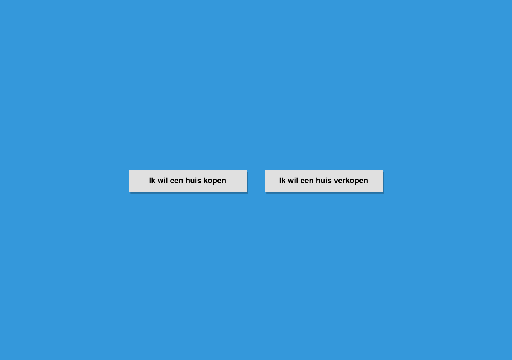
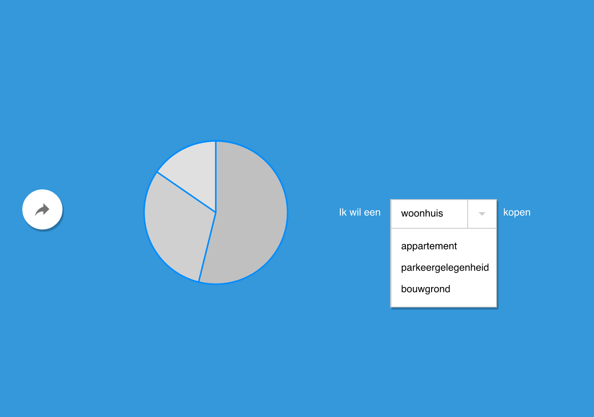
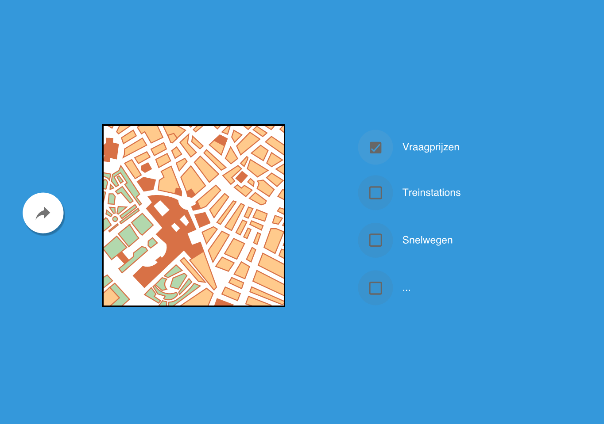
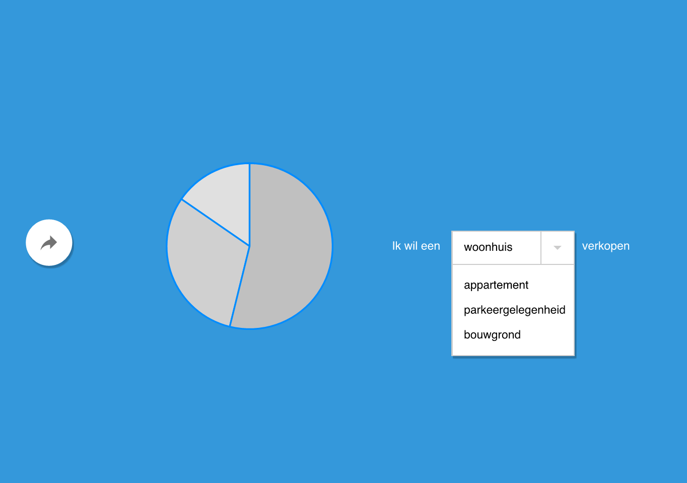

# Programmeerproject

Er zijn voornamelijk twee groepen mensen geïnteresseerd in data van www.funda.nl: kopers en verkopers. Op deze twee groepen wil ik me richten. Met dit project wil ik een aantal vragen kunnen beantwoorden:

Vragen voor kopers:
* Wat zijn de duurste/goedkoopste gebieden?
* Hoe verhouden die zich tot de treinstations/wegen?

Vragen voor verkopers:
* Hoeveel kan ik ervoor vragen?
* Hoe lang duurt het voordat huizen worden verkocht?

Dit zijn vragen die niet kunnen worden beantwoord met behulp van de huidige Funda-website. 

De tool begint met een landing page:

## Landing page

Hier scheid ik direct de kopers en verkopers. 

## Kopers - soort huis

De koper kiest hier het soort huis dat hij of zij wil: woonhuis, appartement, parkeerplaats of bouwgrond. Funda maakt hier ook onderscheid tussen en deze stap zorgt ervoor dat de scraper niet door alle huizen heen hoeft, maar alleen door bijvoorbeeld alle appartementen. 

Op de site van Funda staan wel de aantallen vermeld, maar dit zegt een bezoeker niet zoveel. Een pie chart geeft meteen een visueel overzicht van de aantallen.

### Benodigde informatie
Aantal huizen per categorie over heel Nederland. 

1. http://www.funda.nl/koop/heel-nederland/
2. 1e .search-sidebar-filter  
3. alle .radio-group-items
4. .count

## Kopers - choropleth

Nu de koper gekozen heeft voor een soort huis, kan een weergave worden getoond van de prijzen van dat soort huis in Nederland. Dit gebeurt door middel van een choropleth-kaart. Postcodegebieden zijn gekleurd op basis van prijs. Het gaat hier om 4-cijferige postcodes. Ik kies bewust voor 4-cijferige postcodes, en niet voor bijvoorbeeld steden. In het laatste geval zou bijvoorbeeld heel Amsterdam een kleur krijgen, terwijl het juist interessant kan zijn om te zien welke gebieden in Amsterdam nu duurder zijn dan andere.

Gebruikers kunnen ook een laag met treinstations toevoegen en een met snelwegen. Zo kun je op zoek naar een huis dat in een goedkoper gebied is maar wel gunstig ligt ten opzichte van je werk. 

### Benodigde informatie
Shapefile/geoJSON met postcodegebieden, een met treinstations en een met snelwegen. www.postcodeapi.nu geeft bij het geven van een postcode een geoJSON terug van dat gebied.

Daarnaast heb ik de gemiddelde vraagprijs in die postcode voor dat soort huis nodig:

1. http://www.funda.nl/koop/hoorn-nh/1624/woonhuis/
2. .search-result-price

Ik zou ook graag nog verder willen filteren op:

# aantal kamers: 1, 2+, 3+, 4+, 5+
# woonoppervlakte: 50+, 75+, 100+, 150+, 250+
# aanwezigheid van: balkon, bedrijfsruimte, CV ketel, dakterras, duurzame energie, garage, jacuzzi, kluswoning, lift, lig/zitbad, monumentaal pand, open haard, sauna, schuur/berging, stoomcabine, tuin, zwembad

## Verkopers - soort huis
