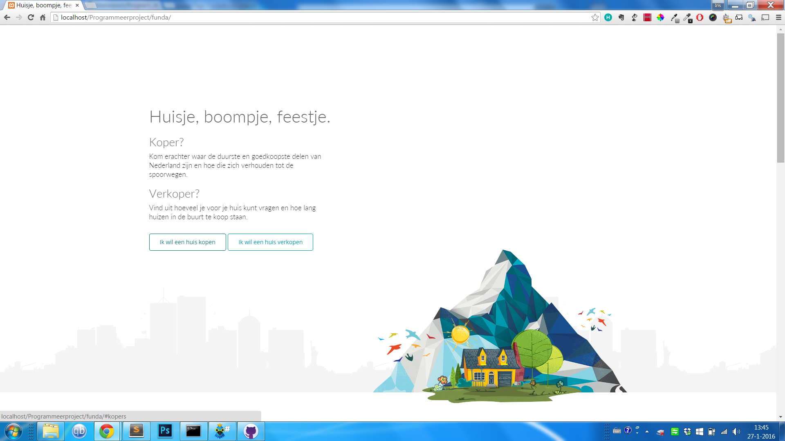
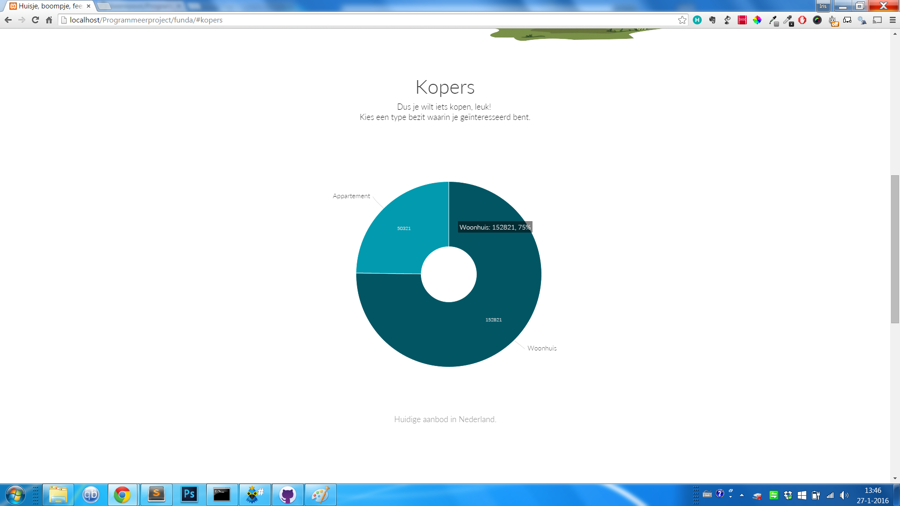
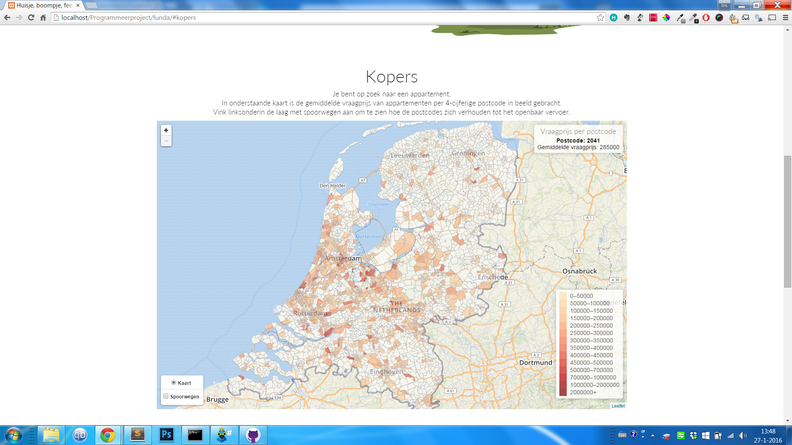
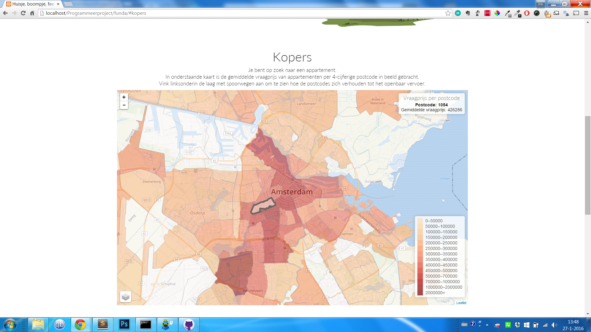
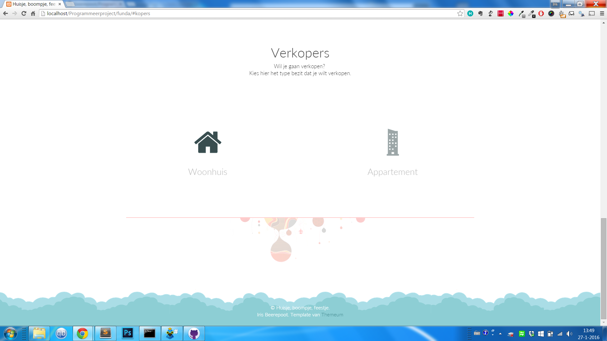
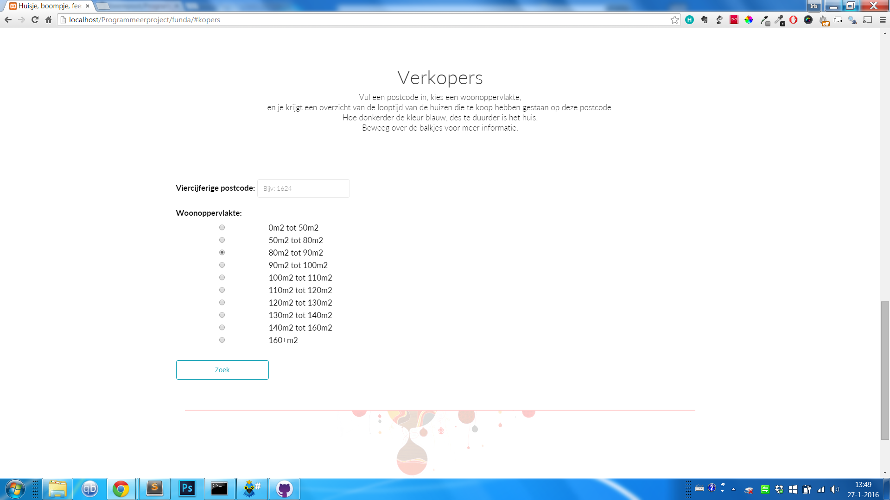
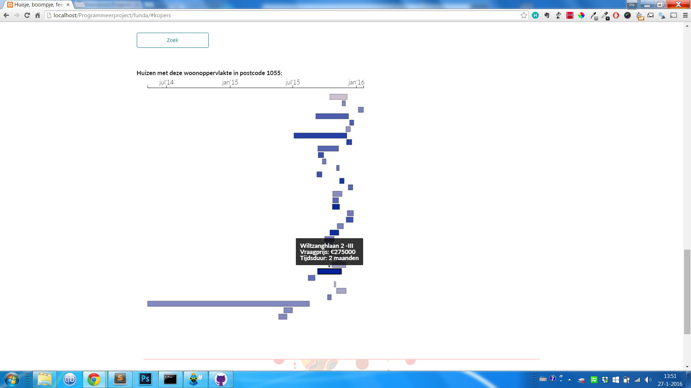

# Huisje, boompje, feestje
Tool die het kopers mogelijk maakt te zien waar de duurste en goedkoopste gebieden zich bevinden en hoe die zich verhouden tot de Nederlandse spoorwegen en -stations. Verkopers kunnen bepalen hoeveel ze voor hun huis kunnen vragen door te zien hoe lang huizen met een specifieke woonoppervlakte in de buurt te koop hebben gestaan en voor welke prijs. 

# Screenshots

# Auteur
Iris Beerepoot
[LinkedIn](https://nl.linkedin.com/in/irisbeerepoot)

# License
Copyright © 2016 Iris Beerepoot 
Released under the MIT license

Packages in de map npm-modules vallen hier niet onder en hebben elk hun eigen license. Data in funda/js/json komt voornamelijk van www.funda.nl en geodata in funda/js/geojson met toestemming verkregen van [Webmappers Geocoders API](http://places.geocoders.nl/), waarvoor dank.